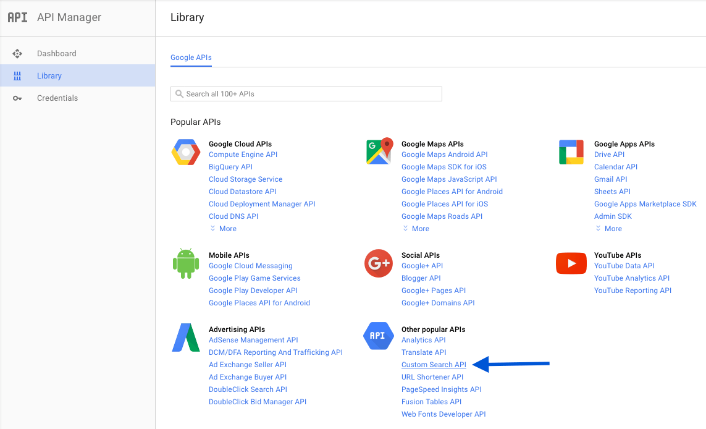

# Google Custom Search Engine lib

https://market.enonic.com/vendors/enonic/com.enonic.lib.google.cse

## Releases and Compatibility

| App version | Required XP version | Download |
| ----------- | ------------------- | -------- |
| 1.0.0 | 6.6.0 |
| 2.0.0 | 7.0.0 |

## Usage

### Install the lib

Install the google-cse lib to the local maven repository.

    gradle install

Use the google-cse lib in any project by adding it in the dependency.

    repositories {
        mavenLocal()
    }

After this, add the following dependency (where ``<version>`` is the actual version to use):

    dependencies {
        include "com.enonic.lib:google-cse:<version>"
    }

### API-key and engine id

To be able to get search result from Google, you need an api-key and a search engine id from Google. The api-key is obtained by setting up a credential at Googles [API manager](https://console.developers.google.com), and enabling the "custom search API".

Get the search engine id by registering an engine at Googles [custom search engine console](https://cse.google.com).

### Search

    var libGce = require('/lib/cse');

    libGce.search({
        googleApiKey: "AIzaSyAwerR12fozZQ-rU__sfeFvN_jt21sdf312312as"
        googleCustomSearchEngineId: "02515953347627444:trertmiogwersdf"
        q: "enonic xp"
        })

| Parameter | Required | Meaning | Notes |
| --------- | -------- | ------- | ----- |
| googleApiKey | Yes | | |
| googleCustomSearchEngineId | Yes | | |
| q | Yes | The search query | |
| alt | | Data format for the response. | Valid values: json, atom. Default value: json |
| callback | | Callback function. | Name of the JavaScript callback function that handles the response. Used in JavaScript JSON-P requests. |
| fields | | Selector specifying a subset of fields to include in the response. | |
| prittyPrint | | Returns response with indentations and line breaks. | |
| quotaUser | | Alternative to userIp. | |
| userIp | | IP address of the end user for whom the API call is being made. | |

[More information about the parameters](https://developers.google.com/custom-search/json-api/v1/using_rest) at Googles custom search doc.

### Mock response

By default google cse gives you a quota for 100 search per day. This limit is often reached fast when you're developing and testing. To save the quota for real searches, you can use the mock response. Simply change the lib required by the controller to get mockcse.js instead. The response is mimicking the result of a google cse in the enonic xp docs. At the moment, only a succesful reponse is mocked.

    var libGce = require('/lib/mockcse');

    libGce.search({
        googleApiKey: "AIzaSyAwerR12fozZQ-rU__sfeFvN_jt21sdf312312as"
        googleCustomSearchEngineId: "02515953347627444:trertmiogwersdf"
        q: "enonic xp"
        })
